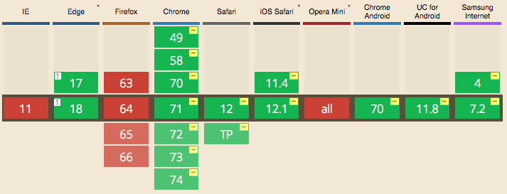

# react-clamp-text

> A React component that clamps long text into specified lines using CSS.

[](https://www.npmjs.com/package/react-clamp-text) [](https://standardjs.com)


## Install

```bash
npm install --save react-clamp-text
```

## Usage

```tsx
import * as React from 'react';
import ClampText from 'react-clamp-text';

class Example extends React.Component {
  render () {
    return (
      <ClampText
        line={3}
        showMore={true}
        showMoreText="Expand"
        showLessText="Collapse"
      >
        Lorem ipsum dolor sit amet, consectetur adipiscing elit, sed do
        eiusmod tempor incididunt ut labore et dolore magna aliqua. Ut enim
        ad minim veniam, quis nostrud exercitation ullamco laboris nisi ut
        aliquip ex ea commodo consequat. Duis aute irure dolor in
        reprehenderit in voluptate velit esse cillum dolore eu fugiat nulla
        pariatur. Excepteur sint occaecat cupidatat non proident, sunt in
        culpa qui officia deserunt mollit anim id est laborum.
      </ClampText>
    )
  }
}
```

## Custom Styling

There are two ways of assigning custom CSS rules to `<ClampText/>`.

`className` can be used to specify a custom class name. This class will be applied to the text itsef.

```tsx
// style.css
.myText {
  color: red;
}

// React
import classes from './style.css';

return <ClampText className={classes.myText} />;
```

Another way is using `classes` property. This property consists of two key-value pairs:
- `text`: CSS rules that will be applied to the text.
- `button`: CSS rules that will be applied to the "Show More" button.

```tsx
const classes = {
  text: {
    fontWeight: 'bold',
  },
  button: {
    color: 'red',
    marginTop: 16,
  }
};
return <ClampText classes={classes} />;
```

If both `classes` and `className` are specified, the CSS rules will be merged.

## Browser Support

Since this component depends on vendor CSS rule `-webkit-line-clamp`, it does not support Firefox currently. See [Can I use...](https://caniuse.com/#search=line-clamp) for details. (compatibility graph by [caniuse.com](https://caniuse.com/) )



## Limitation

1. This component is implemented with the vendor CSS rule `-webkit-line-clamp` and may stop working when vendors change the implementation.
2. Animation is not supported.
3. Firefox is not supported.

## Contributing

Read the [Contributing Guide](CONTRIBUTE.md).

## License

MIT © [charlee](https://github.com/charlee)
